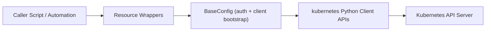
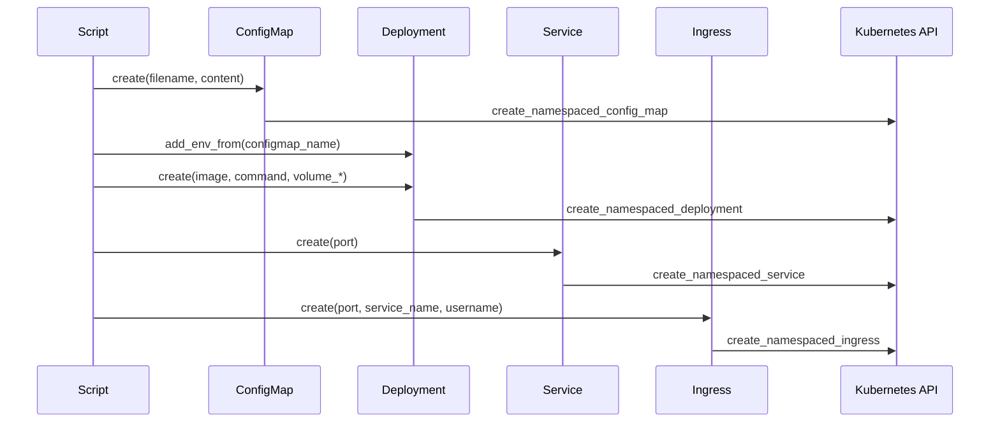

# Architecture and Patterns

This package provides small wrappers around Kubernetes Python client APIs for
resource-level operations.

## Architecture layers

1. Caller script or automation invokes resource classes.
2. Resource wrappers (`Deployment`, `Service`, `Ingress`, `ConfigMap`, `Pod`)
   build request payloads and call CRUD-like operations.
3. `BaseConfig` loads runtime auth context and initializes Kubernetes API clients.
4. Kubernetes Python client sends calls to the Kubernetes API server.

## Typical rollout flow

Common rollout sequence when an app needs file-based configuration and network exposure:

## Patterns used

### Resource-wrapper pattern

Each Kubernetes resource has a dedicated class that maps high-level method calls
to Kubernetes client operations.

### Shared base-config pattern

`BaseConfig` centralizes:

- Authentication mode selection (`load_incluster_config` or `load_kube_config`).
- API client construction (`AppsV1Api`, `CoreV1Api`, `NetworkingV1Api`).

This avoids repeated setup logic in each resource class.

### CRUD facade pattern

Wrappers expose direct methods like `create`, `update`, and `delete` instead of
requiring callers to construct raw Kubernetes API objects for routine operations.

## Current-behavior caveats

- `Service.create(port)` always exposes service port `80`; `port` is used as
  `target_port`.
- `Service` and `Ingress` do not expose update methods.
- `Deployment` can mount a ConfigMap key into a volume only when all volume
  arguments are provided together.
- `Ingress` host and TLS secret naming are tied to `username` and `domain_name`
  (`<username>.cdr.<domain_name>` and `<username>-code-tls`).
- `Ingress` annotations are intentionally opinionated around nginx and
  cert-manager defaults. External users should confirm those defaults fit their
  cluster before adopting the helper.
- `ConfigMap.create(filename, content)` and `ConfigMap.update(filename, content)`
  keep the original inline behavior by default. Calling `create()` or `update()`
  with no inline args serializes the instance's accumulated `data` map instead.
